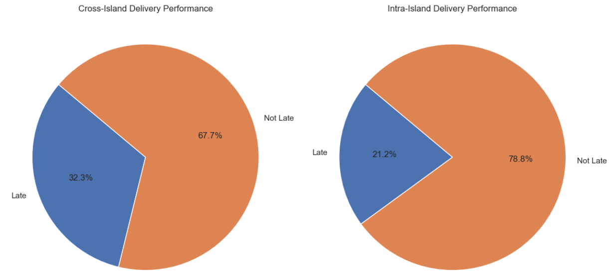

# Shopee_Code_League_Logistics

## Background

Due to the recent COVID-19 pandemic across the globe, many individuals are increasingly turning to online platforms like Shopee to purchase their daily necessities. This surge in online orders has placed a strain onto Shopee and our logistics providers but customer expectations on the timely delivery of their goods remain high. On-time delivery is arguably one of the most important factors of success in the eCommerce industry and now more than ever, we need to ensure the orders reach our buyers on time in order to build our users’ confidence in us.

In order to handle the millions of parcels that need to be delivered everyday, we have engaged multiple logistics providers across the region. Only the best logistics providers that are able to meet Shopee’s delivery standards are partnered with us.

The performance of these providers is monitored regularly and each provider is held accountable based on the Service Level Agreements (SLA). Late deliveries are flagged out and penalties are imposed on the providers to ensure they perform their utmost.

The consistent monitoring and process of holding our logistics providers accountable allows us to maintain our promise of timely deliveries to our buyers.

## Task
Main Task: Identify all the orders that are considered late depending on the Service Level Agreements (SLA) with Shopee's Logistics Provider.

### In addition to the main task, below are some relevant visualizations that may be useful for answering the following business related questions
 - ### Q1): What is the distribution of orders that were considered to be late?
 
   - ### Q1a): Does the Type of delivery impact whether a delivery is more likely to be late or not?
  
 - ###  Q2): What is the distribution of buyers by location?
  
 - ###  Q3): What is the distribution of orders that were made cross-island?
  
